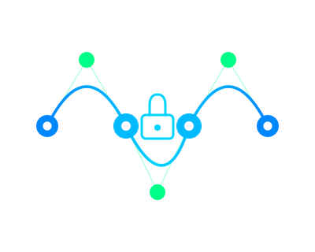

<p align="center">
  
</p>

<p align="center">
  
  
  
  
</p>

<h1 align="center">MeshSig</h1>

<p align="center">
  <strong>Cryptographic security layer for AI agents.</strong><br>
  <em>Identity · Signed Messages · Verified Handshakes · Trust Scoring</em>
</p>

<p align="center">
  <a href="https://meshsig.ai">meshsig.dev</a> ·
  <a href="#cli">CLI</a> ·
  <a href="#dashboard">Dashboard</a> ·
  <a href="#mcp-server">MCP</a> ·
  <a href="#integrations">Integrations</a> ·
  <a href="#api-reference">API</a> ·
  <a href="#audit--compliance">Audit</a>
</p>

---

## What is MeshSig?

MeshSig gives every AI agent a **cryptographic identity** and secures every agent-to-agent communication with **Ed25519 digital signatures**.

When Agent A sends a task to Agent B, MeshSig:
- Signs the message with Agent A's private key
- Verifies the signature mathematically before delivery
- Logs the interaction with tamper-proof audit trail
- Updates trust scores based on verified history

No one can impersonate an agent. No one can tamper with a message. Every interaction has cryptographic proof.

## Quick Start

**Use directly (no install):**
```bash
npx meshsig init        # Generate Ed25519 identity
npx meshsig sign "msg"  # Sign a message
npx meshsig start       # Start the server + dashboard
```

**Or install globally:**
```bash
npm install -g meshsig
meshsig start
```

**Or from source:**
```bash
git clone https://github.com/carlostroy/meshsig.git
cd meshsig
npm install && npm run build
node dist/main.js start
```

Open `http://localhost:4888` — live security operations dashboard.

## CLI

MeshSig works as a standalone command-line tool. No server required for signing and verifying.

```bash
# Generate your Ed25519 identity
meshsig init
# ✓ Identity generated
#   DID: did:msig:3icqQkmJWby4S5rpaSRoCcKvjKWdTvqViyPrCEC7Tek2

# Sign a message
meshsig sign "Deploy the new model to production"
# ✓ Message signed
#   SIGNATURE: HkyrXOPOXF7v422A4iOcg/qkg...

# Verify a signature (with DID or public key)
meshsig verify "Deploy the new model" "HkyrXO..." "did:msig:3icq..."
# ✓ SIGNATURE VALID

# Show your identity
meshsig identity

# List agents on the mesh
meshsig agents

# Server statistics
meshsig stats

# Export audit log
meshsig audit --json > report.json

# Rotate your keypair (DID stays the same)
meshsig rotate-key

# Revoke a compromised agent
meshsig revoke "did:msig:..." --reason "Key leaked"

# List revoked agents
meshsig revoked

# Start the server
meshsig start --port 4888
```

All commands support `--json` for piping and automation.

## Dashboard

Real-time security operations center showing agents, connections, trust scores, and signed messages flowing through the network.

```bash
meshsig start --port 4888
# Open http://localhost:4888
```

Features:
- Live network graph with D3.js force simulation
- Flowing particles on connections between agents
- Sound notifications on message signing
- Agent stats: trust scores, interactions, capabilities
- Local and remote agent distinction
- Event feed with signature verification status

## Audit & Compliance

Every signed message is logged with cryptographic proof. Export the complete audit trail for compliance.

**API endpoint:**
```bash
curl http://localhost:4888/audit/export
```

Returns JSON with:
- Summary (total agents, messages, verified/failed counts, average trust)
- All agents with DIDs, public keys, trust scores
- All connections with handshake proof
- All messages with signatures and verification status

**CLI:**
```bash
meshsig audit --json > audit-2026-03.json
```

## Public Signature Verifier

Anyone can verify a signature in the browser — no account, no install needed.

Open `http://localhost:4888/verify`, paste a message, signature, and public key or DID. One click verification.

**API:**
```bash
curl -X POST http://localhost:4888/verify \
  -H 'Content-Type: application/json' \
  -d '{"message":"hello","signature":"base64...","did":"did:msig:..."}'
# {"valid": true, "verifiedAt": "2026-03-13T..."}
```

## Security Features

### Key Rotation

Rotate an agent's keypair without losing its identity (DID). If a key is compromised, generate a new one and the old key becomes invalid immediately.

```bash
# CLI
meshsig rotate-key

# API
curl -X POST http://localhost:4888/agents/rotate-key \
  -H 'Content-Type: application/json' \
  -d '{"did":"did:msig:...","currentPrivateKey":"base64..."}'
```

All rotations are logged. The DID stays the same — only the signing key changes.

### Agent Revocation

Permanently revoke a compromised agent. All future messages from or to this agent will be rejected with `403 Forbidden`.

```bash
# CLI
meshsig revoke "did:msig:..." --reason "Key leaked"

# API
curl -X POST http://localhost:4888/agents/revoke \
  -H 'Content-Type: application/json' \
  -d '{"did":"did:msig:...","reason":"Compromised key"}'
```

Revocation is irreversible by design. Check the revocation list:

```bash
meshsig revoked
# or: curl http://localhost:4888/revoked
```

### Rate Limiting

Built-in protection against abuse. 60 requests per minute per IP address. Exceeding the limit returns `429 Too Many Requests` with retry information.

## Integrations

MeshSig is **framework-agnostic** — it works with any AI agent framework via the HTTP API, CLI, or MCP protocol.

### Any Framework (HTTP API)

Use the REST API to sign and verify messages from any language or framework:

```bash
# Register an agent
curl -X POST http://localhost:4888/agents/register \
  -H 'Content-Type: application/json' \
  -d '{"name":"my-agent","capabilities":[{"type":"analysis"}]}'

# Send a signed message
curl -X POST http://localhost:4888/messages/send \
  -H 'Content-Type: application/json' \
  -d '{"fromDid":"did:msig:...","toDid":"did:msig:...","message":"task","privateKey":"..."}'
```

Works with **LangChain**, **CrewAI**, **AutoGen**, **LlamaIndex**, **Semantic Kernel**, **Haystack**, custom agents, and any system that can make HTTP requests.

### MCP (Claude, Cursor, Windsurf, Cline)

MeshSig ships as a native MCP server. See the [MCP Server](#mcp-server) section.

```bash
npx meshsig-mcp
```

### OpenClaw (Native)

MeshSig includes built-in scripts for OpenClaw agent-to-agent delegation:

```bash
# With MeshSig running on the same server as OpenClaw:
bash scripts/install.sh
```

The install script automatically:
1. Discovers all OpenClaw agents on the machine
2. Generates Ed25519 identity (`did:msig:...`) for each agent
3. Creates verified connections via cryptographic handshake
4. Replaces `invoke.sh` with a signed version (original backed up)

```
Before:  Agent A → invoke.sh → Agent B  (no proof)
After:   Agent A → invoke.sh → [SIGN] → MeshSig → [VERIFY] → Agent B
```

### Auto-register agents

```bash
# When a new agent is provisioned:
bash scripts/register-agent.sh agent-name-here

# When an agent is removed:
bash scripts/unregister-agent.sh agent-name-here
```

### Python / JavaScript SDK

Use MeshSig programmatically:

```javascript
// JavaScript / TypeScript
import { generateIdentity, sign, verify } from 'meshsig';

const agent = await generateIdentity();
const signature = await sign('hello', agent.privateKey);
const valid = await verify('hello', signature, agent.publicKey); // true
```

```python
# Python — use the HTTP API
import requests

# Register
r = requests.post('http://localhost:4888/agents/register',
    json={'name': 'my-agent', 'capabilities': [{'type': 'analysis'}]})
agent = r.json()

# Verify
r = requests.post('http://localhost:4888/verify',
    json={'message': 'hello', 'signature': sig, 'did': agent['record']['did']})
print(r.json()['valid'])  # True
```

## How It Works

### Identity

Every agent receives an Ed25519 keypair and a W3C Decentralized Identifier:

```
did:msig:6QoiRtfC29pfDoDA4um3TMrBpaCq6kr...
```

The DID is derived from the public key. Impossible to forge. Universally verifiable.

### Signed Messages

Every message carries a digital signature:

```json
{
  "from": "did:msig:6Qoi...",
  "to": "did:msig:8GkC...",
  "message": "Analyze the Q1 sales report",
  "signature": "LsBbF/FRgaacn1jIMBwK6hxr22jCT...",
  "verified": true
}
```

### Trust Scoring

Trust is earned, not declared:
- Every verified message: trust increases
- Every failed verification: trust decreases
- Based on real interactions, not self-assessment

### Multi-Server Networking

Connect MeshSig instances across servers:

```bash
# Server 1
meshsig start --port 4888

# Server 2 — connects to Server 1, agents sync automatically
meshsig start --port 4888 --peer ws://server1:4888
```

Remote agents appear on the dashboard with origin labels.

## API Reference

```
GET  /                  Live dashboard (Security Operations Center)
GET  /health            Server status
GET  /stats             Network statistics
GET  /snapshot          Full network state
GET  /verify            Public signature verifier (browser)
POST /verify            Verify a signature (API)
GET  /audit/export      Compliance audit report (JSON)

POST /agents/register   Register agent → returns Ed25519 keypair + DID
GET  /agents            List all agents with trust scores
GET  /agents/:did       Get specific agent
POST /agents/rotate-key Rotate an agent's Ed25519 keypair
POST /agents/revoke     Revoke a compromised agent
GET  /revoked           List all revoked agents

POST /discover          Find agents by capability
POST /discover/network  Find across connected peers

POST /messages/send     Sign + verify + log a message (blocks revoked agents)
POST /messages/verify   Verify a message signature

POST /handshake         Cryptographic handshake between agents
GET  /connections       List verified connections
GET  /messages          Recent signed messages

GET  /peers             Connected MeshSig instances
POST /peers/connect     Connect to another instance

WS   ws://host:port     Live event stream
```

## Security

| Layer | Implementation |
|-------|---------------|
| Signatures | Ed25519 — same as SSH, Signal, WireGuard, TLS 1.3 |
| Identity | W3C DID standard (`did:msig:`) |
| Handshake | Mutual challenge-response with nonce and timestamp |
| Storage | Local SQLite — no cloud dependency |
| Audit | Tamper-evident log with cryptographic hashes |
| Key Rotation | Generate new keypair, DID preserved, old key invalidated |
| Revocation | Permanently block compromised agents, public revocation list |
| Rate Limiting | 60 req/min per IP, protects against DDoS |

See [docs/SECURITY.md](docs/SECURITY.md) for the full security whitepaper.

## Requirements

- Node.js ≥ 18

No database to configure. No cloud services. No API keys. Install, start, secure.

## MCP Server

MeshSig works as a Model Context Protocol (MCP) server — any AI tool can use it directly.

**9 tools available:** `meshsig_init`, `meshsig_sign`, `meshsig_verify`, `meshsig_identity`, `meshsig_agents`, `meshsig_stats`, `meshsig_audit`, `meshsig_revoke`, `meshsig_revoked`

### Claude Desktop

Add to `~/.claude/claude_desktop_config.json`:

```json
{
  "mcpServers": {
    "meshsig": {
      "command": "npx",
      "args": ["meshsig-mcp"]
    }
  }
}
```

### Cursor / Windsurf / Cline

Add to your MCP config:

```json
{
  "meshsig": {
    "command": "npx",
    "args": ["meshsig-mcp"]
  }
}
```

Then ask your AI: *"Sign this message with MeshSig"* or *"Verify this agent's signature"* — it works directly.

### Environment Variables

- `MESHSIG_SERVER` — MeshSig server URL (default: `http://localhost:4888`)

## License

MIT

---

<p align="center">
  <strong>MeshSig</strong> — Cryptographic security layer for AI agents.<br>
  <a href="https://meshsig.ai">meshsig.ai</a> · <a href="https://github.com/carlostroy/meshsig">GitHub</a>
</p>
